# 목차

1. [프로젝트 소개](#프로젝트-소개)
2. [주요 화면 및 기능 소개](#주요-화면-및-기능-소개)
3. [개발 환경](#개발-환경)
4. [팀원 소개](#팀원-소개)

<br/>

# 🥸 프로젝트 소개

#### 1. 개요

- 서비스 명 : CHECKMATE(체크메이트)
- 한 줄 소개 : SSAFY 12기 2학기 자율 프로젝트
- 기간 : 2025.04.14 ~ 2025.05.22 (39일)

#### 2. 기획 배경

- 목적 : 계약서에 대한 지식이 많지 않은 사회 초년생들이 불공정한 계약을 하지 않도록 돕기 위한 서비스

<br/>

# 🎯 주요 화면 및 기능 소개

#### 메인화면


- 체크메이트 서비스를 설명하는 내용으로 구성
- 페이지의 최하단에는 네이버 뉴스 API를 이용하여 계약 관련된 뉴스를 제공
- 네이버 뉴스를 Redis에 캐싱하여 API 호출↓

#### 계약서 분석
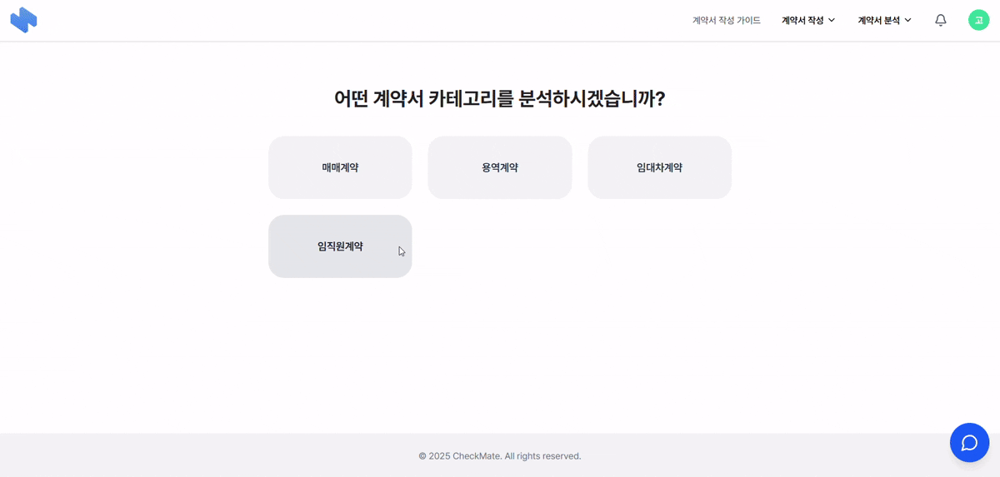
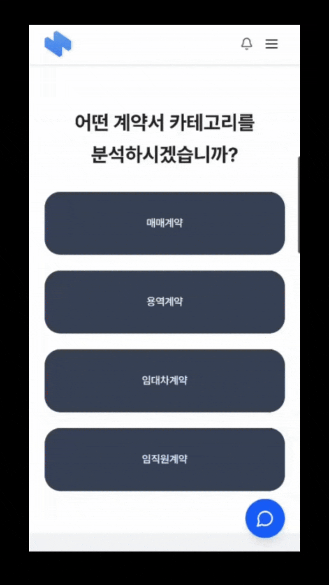
- 계약서 유형을 선택하면 업로드 할 수 있는 페이지로 전환
- 업로드 페이지에서 HWP, PDF, JPG, PNG 확장자의 계약서를 업로드 할 수 있고, 업로드 되면 ClamAV를 통해 바이러스 검사 진행
- 안전한 파일인게 확인되면 AES-GCM 암호화 하여 DEK를 이용해 2-of-2 방식으로 각기 다른 데이터베이스에 분산 저장장


- 분석이 완료되면 WebSocket+Stomp를 이용하여 실시간 알림을 제공
- 분석 결과는 LangChain에 OpenAPI를 이용하여 비동기 병렬형태로 진행
- 분석 프롬프트는 RAG를 이용하여 사전 저장된 Qdrant 법률 데이터를 이용하여 벡터 조회를 통해 나온 결과를 프롬프트에 증강하여 신뢰성과 안정성 증가

#### 계약서 작성 가이드
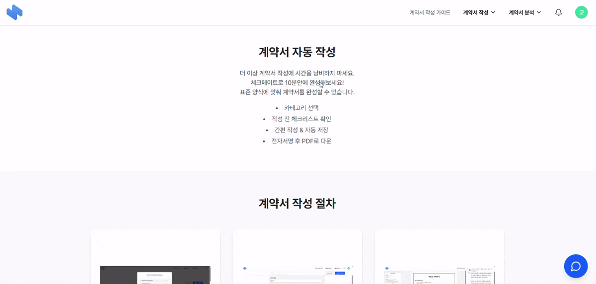
- 계약서를 작성할 때, 어떤 순서로 작성을 하면 되는지에 대한 가이드 페이지

#### 계약서 작성 전 주의사항
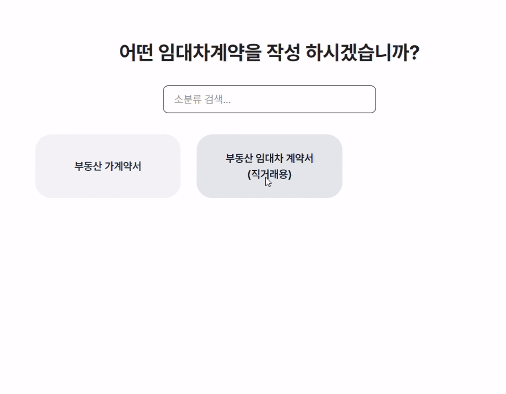
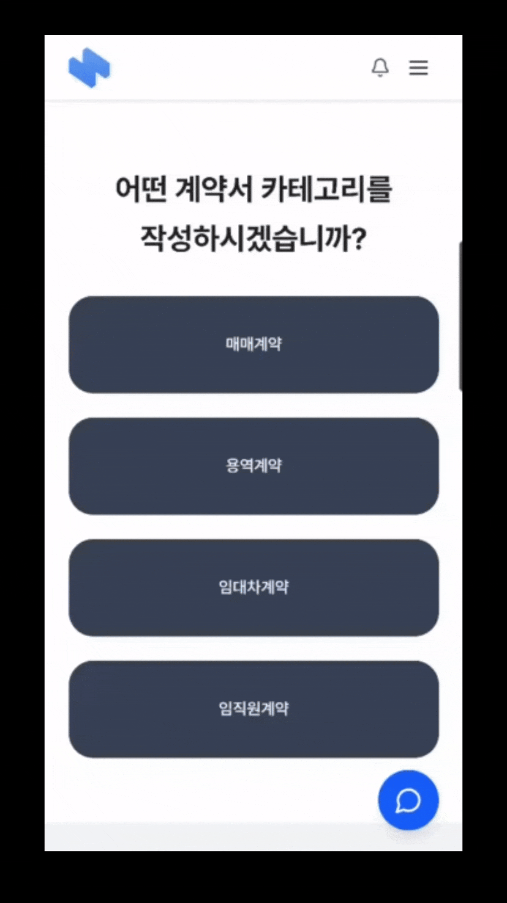
- 계약서 작성 전 주의사항을 모달창으로 제공

#### 계약서 작성
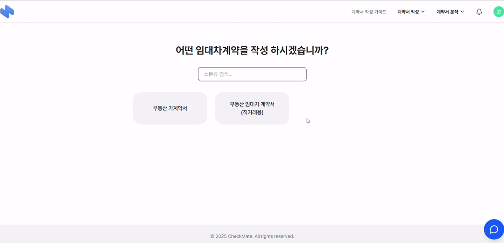


- 카테고리 별 계약서 템플릿을 제공하여 사용자가 필드에 값을 채우면 계약서를 제공
- 자동저장 기능을 통해 이전에 작성한 내용도 쉽게 확인

#### 마이페이지
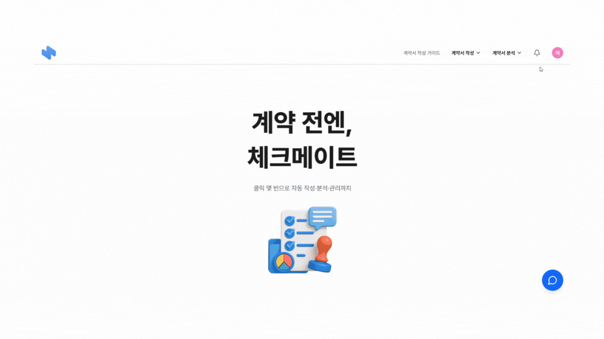

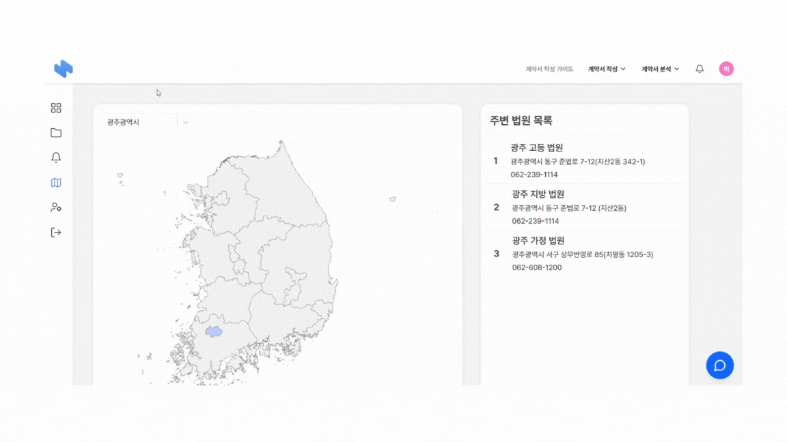

- 마이페이지의 대시보드에는 계약 활동, 알림, 최근 활동 내역을 제공
- 내 계약서 탭으로 이동하면 사용자가 진행했던 계약서 관련 상태를 확인
- d3.js를 통해 지도를 시각화하여 렌더링하는 시간을 감소

#### 계약서 저장
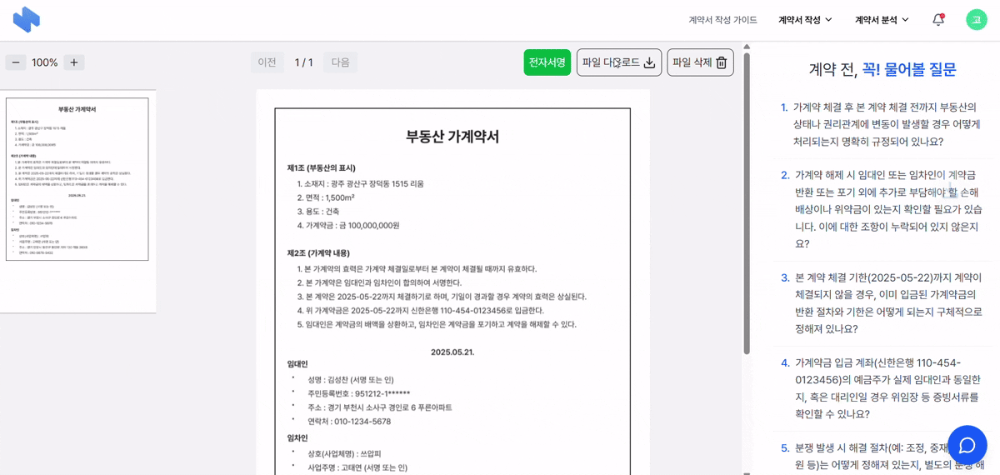

- 저장하기 버튼을 누르면 pdf형태로 사용자에게 제공

#### 전자서명

- DropSignAPI를 이용하여 전자서명 구현현


<br/>

# 👻 개발 환경

### <code>[ 기술 스택 ]</code>

### Frontend


 <br />

### Backend


 <br />

### AI


 <br />

### Database


 <br />

### Infra/DevOps


 <br />

### 협업 툴

 <br />


### <code>[프로젝트 구조]</code>

### Frontend ()

```

```

### Backend (Spring Boot)

```

```

<br/>

### <code>[ ERD ]</code>
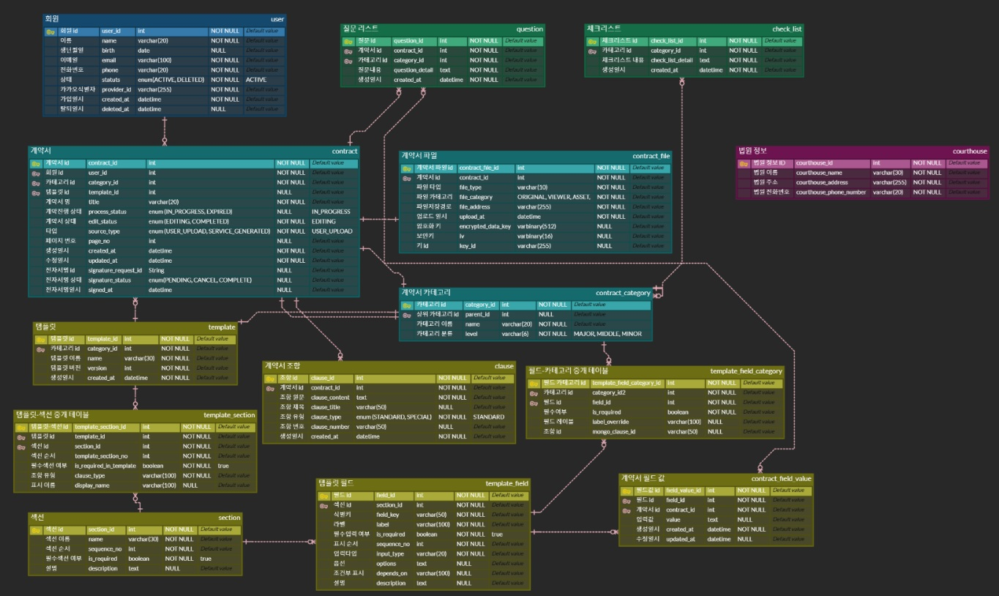

### <code>[ 아키텍처 ]</code>
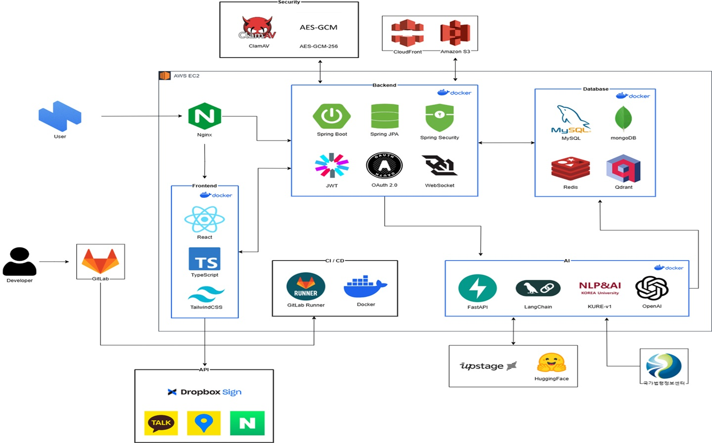

### <code>[ 화면 설계서br/>
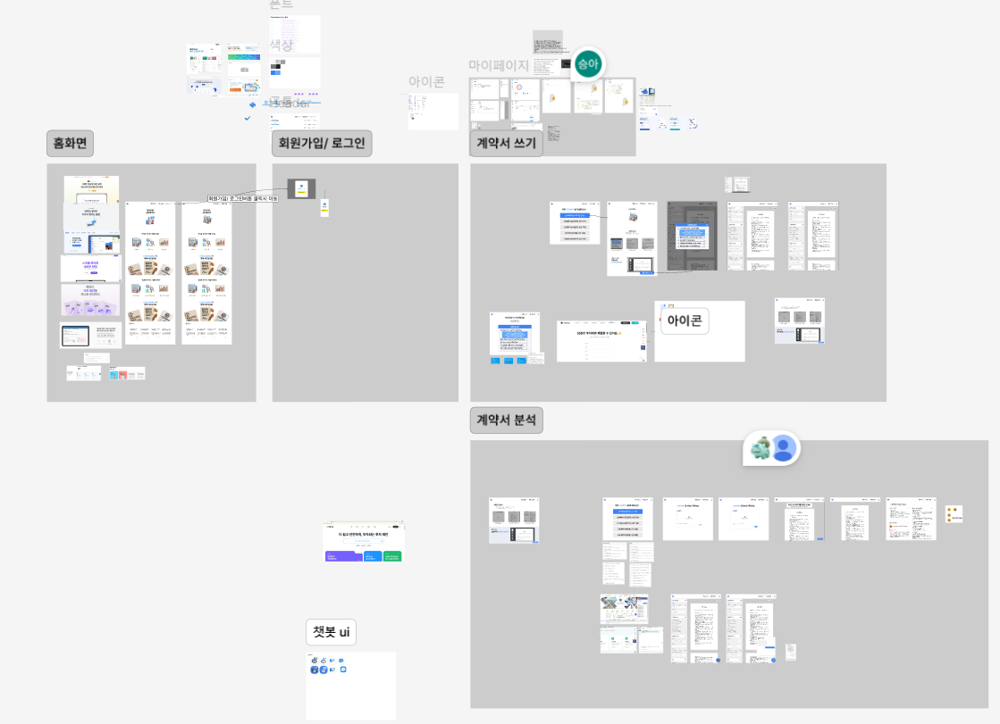


<br/>

# 🥳 팀원 소개
| 이영재(팀장) | 손서현 | 신승아 | 송창현 | 김성찬 | 고태연 |
| --- | --- | --- | --- | --- | --- |
| BE | BE | FE | FE | BE | FE |
<br/>
