# ✔️ 체크메이트

#### 📌 프로젝트 소개
체크메이트는 계약서를 손쉽게 작성하고 작성한 계약서를 업로드하면 LLM을 통해 분석해주는 서비스입니다.

#### 🗓️ 수행 기간
2025.04.14 ~ 2025.05.22

-----

# 👩‍💻 개발 환경
### Frontend
    

### Backend
      

### AI
    

### Database
     

### Infra/DevOps
      

### Tools
   

-----

# 📋 기능 요약

- **계약서 템플릿으로 계약서 작성**: 업무 유형별 사전 검증된 표준 템플릿으로 필수 항목만 입력하면 완성된 계약서 생성
- **계약서 바이러스 검사**: 계약서를 업로드 하면 ClamAV를 통해 바이러스 검사
- **계약서 분석**: 계약서를 AI를 이용해 요약, 위험조항, 누락조항, 개선사항을 생성
- **계약 질문리스트 생성**: 계약서 기준으로 AI를 통해 계약하기 전 질문리스트 생성
- **전자서명을 통한 전자문서 인증**: API를 통해 전자서명 인증 
- **실시간 알림**: 전자서명 완료, 분석완료, 질문리스트 생성이 완료 시 알림

-----

# 🔧 설계

### 시스템 아키텍처
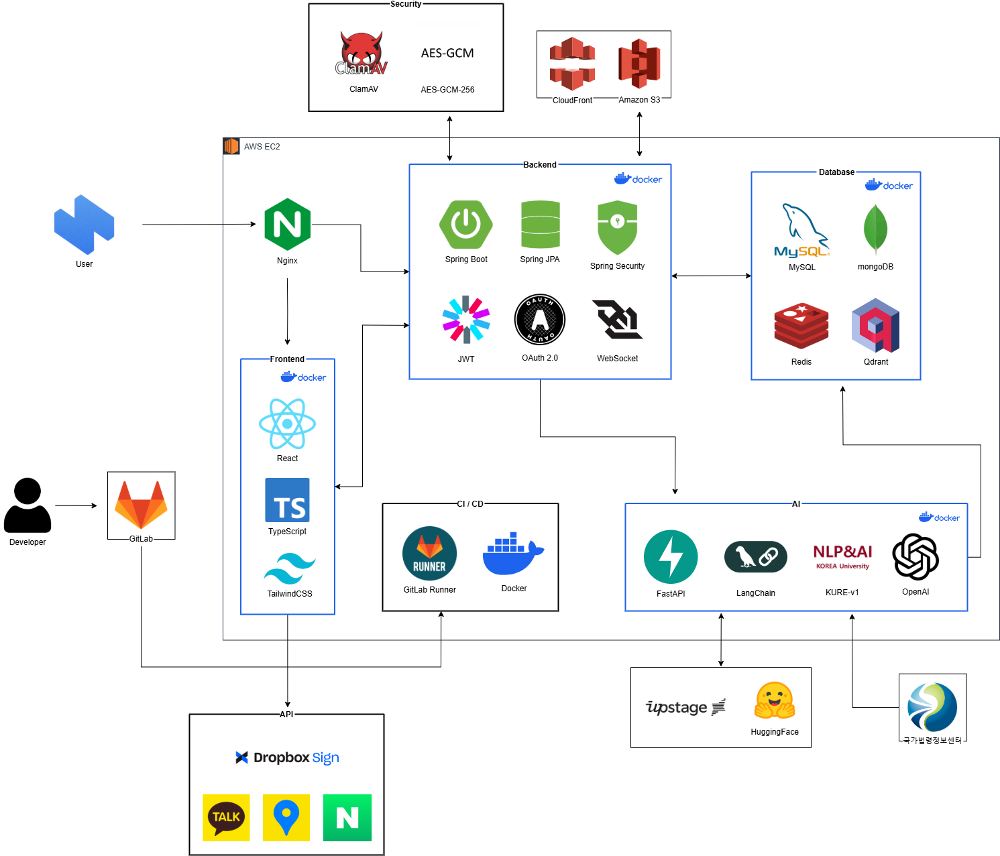

 

### ERD
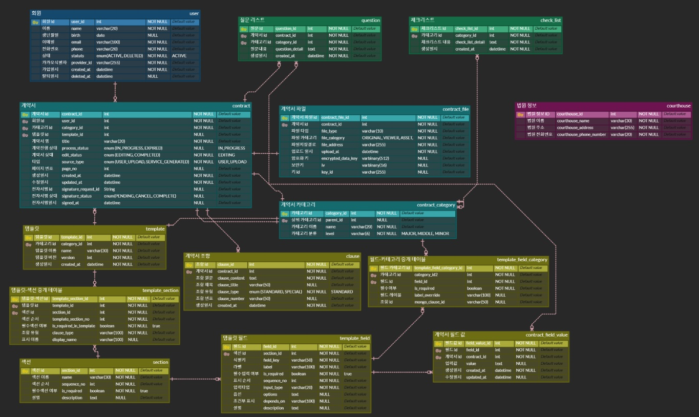

-----

# 🎯 주요 화면 및 기능 소개

#### 메인화면

| 메인화면 | 뉴스 (모바일) |
| :---: | :---: |
|  |  |

#### 계약서 분석

| 업로드 | 업로드 (모바일) |
| :---: | :---: |
| 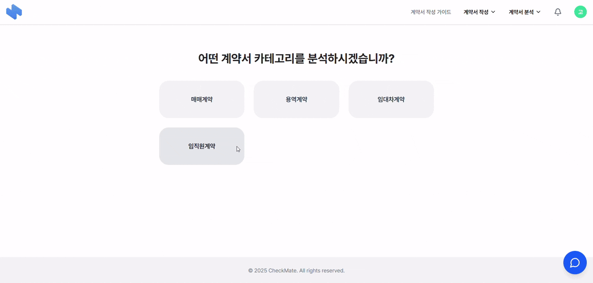 | 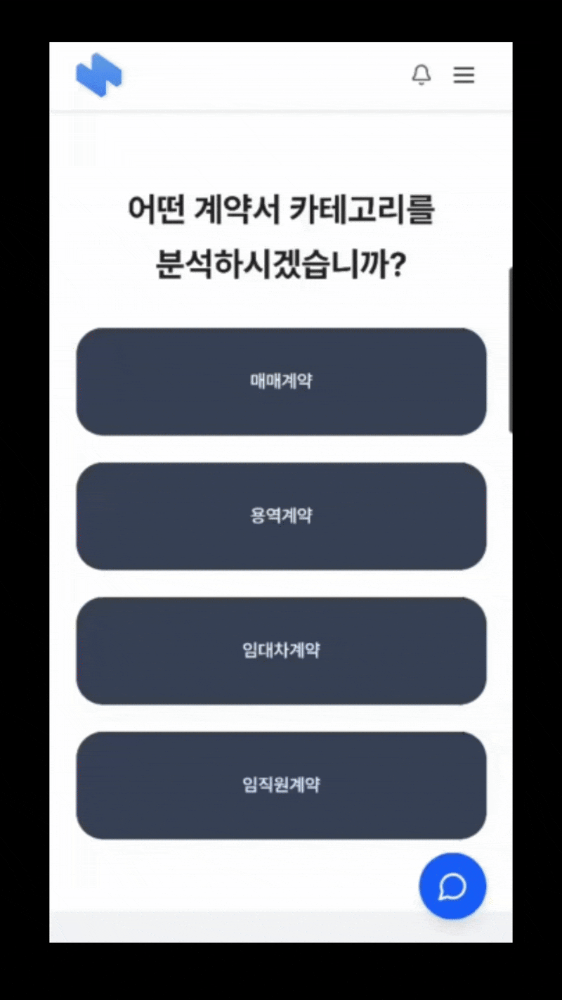 |

| 분석 결과 | 실시간 알림 및 분석 결과 (모바일) |
| :---: | :---: |
|  |  |

#### 계약서 작성 가이드

| 작성 가이드 |
| :---: |
| 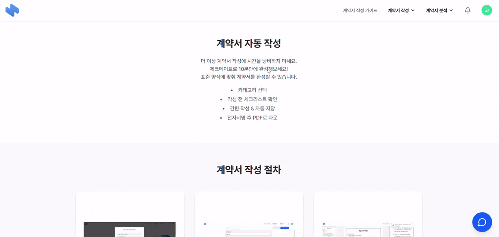 |

#### 계약서 작성 전 주의사항

| 작성 전 주의 사항 | 작성 전 주의사항 (모바일) |
| :---: | :---: |
| 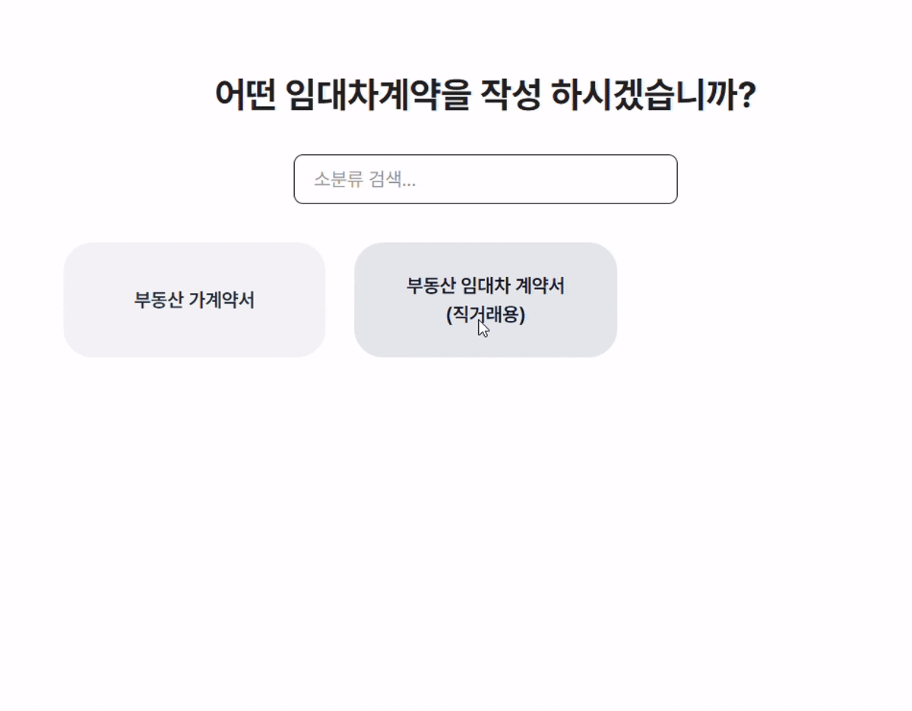 | 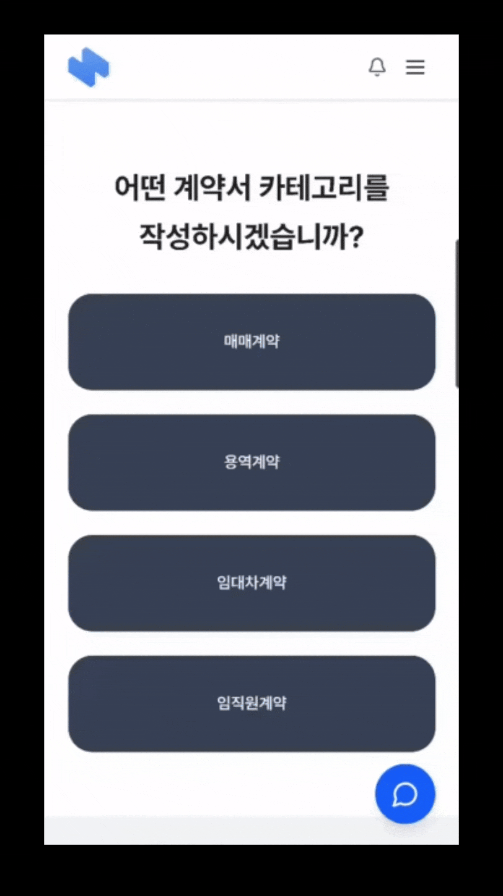 |

#### 계약서 작성

| 계약서 작성 | 계약서 작성 (모바일) | 질문리스트 (모바일) |
| :---: | :---: | :---: |
| 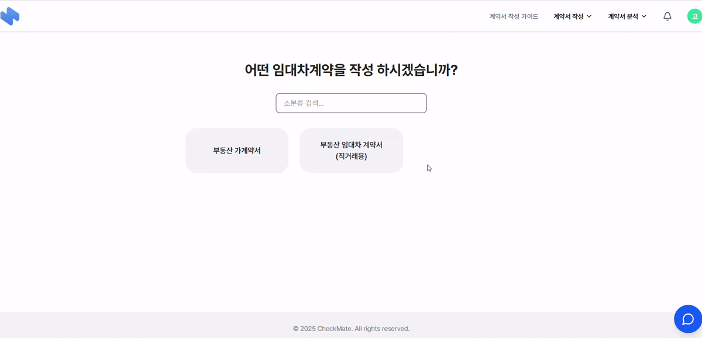 |  |   |

#### 마이페이지

| 마이페이지 | 분석페이지 |
| :---: | :---: |
| 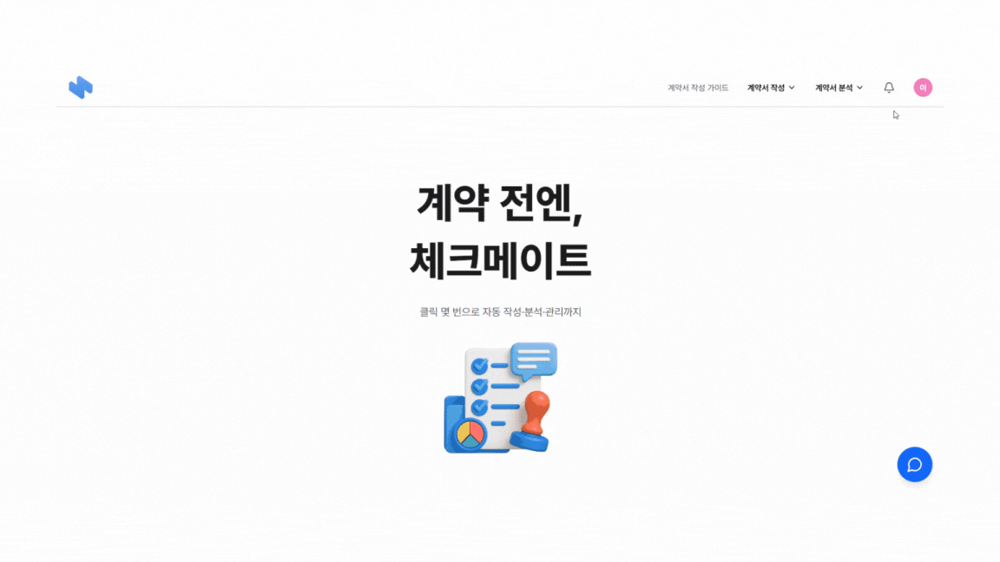 |  |

| 법원 | 법원 (모바일) |
| :---: | :---: |
| 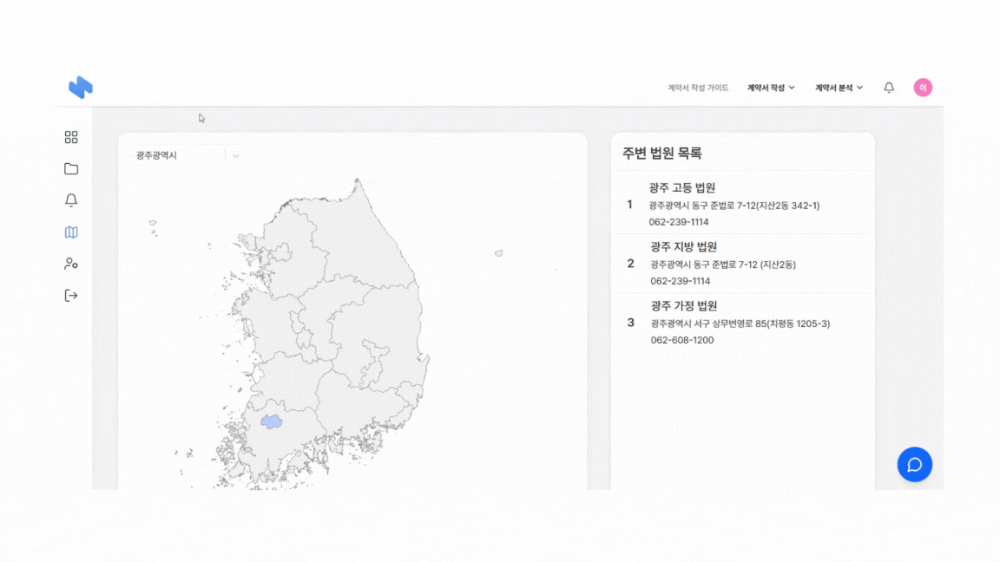 |  |

#### 계약서 저장

| 계약서 저장 | 계약서 저장 (모바일) |
| :---: | :---: |
| 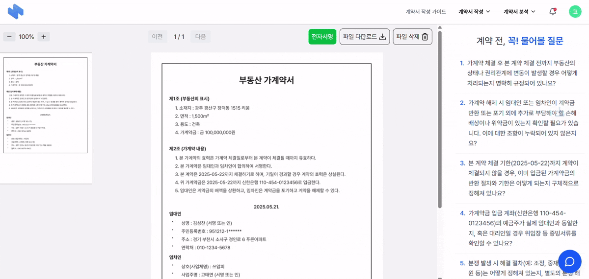 |  |

#### 전자서명
| 전자서명 |
| :---: |
|  |

-----   

# 🥳 팀원
| 이영재(팀장) | 손서현 | 신승아 | 송창현 | 김성찬 | 고태연 |
| :---: | :---: | :---: | :---: | :---: | :---: |
| BE AI | BE | FE | FE | BE AI | FE DevOps |
 